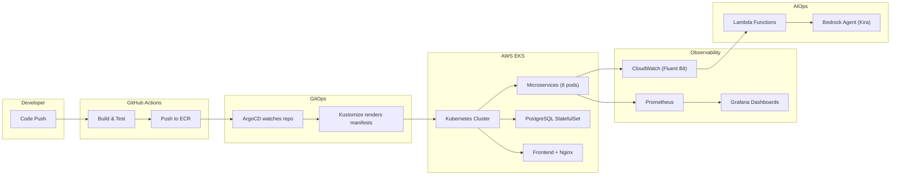
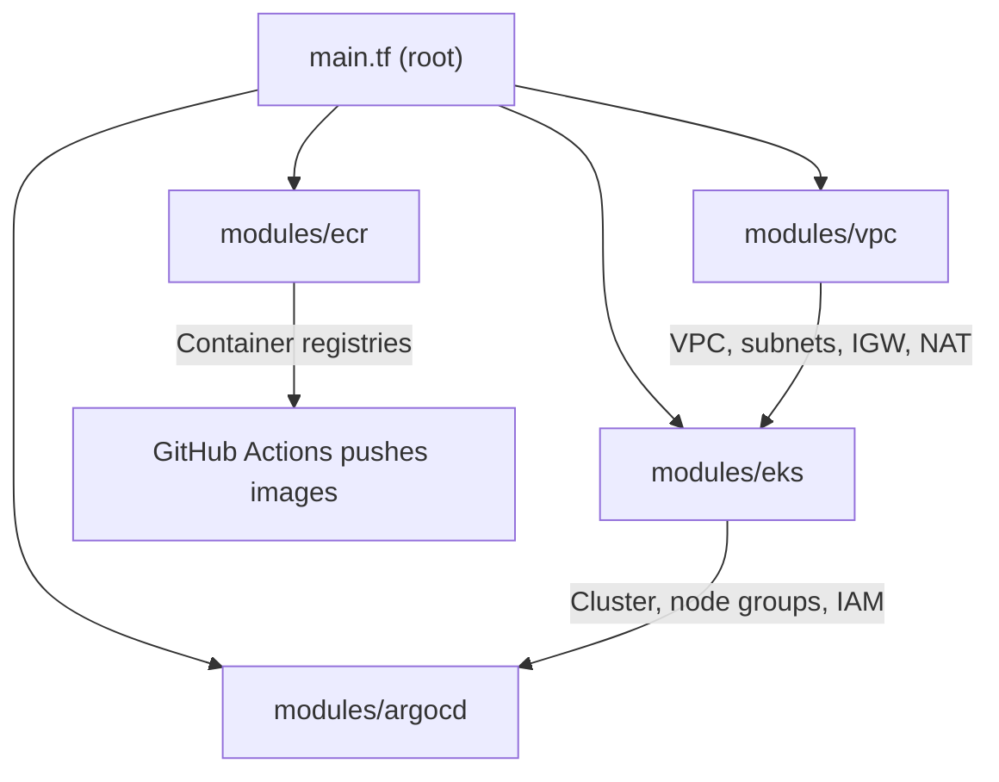

# 🗂️ DevOps + AIOps Playbook — Complete Project Walkthrough

> An end-to-end DevOps project with AIOps integration: from microservices → containers → Kubernetes → CI/CD → GitOps → monitoring → AI-powered operations.

---

## 📌 What Is This Project?

This is a **full-stack DevOps learning project** that builds a **boutique e-commerce platform** using microservices, deploys it on **AWS EKS** with **Terraform**, automates releases with **GitHub Actions + ArgoCD**, monitors with **Prometheus + Grafana**, and adds an **AI-powered operations assistant (Kira)** using AWS Bedrock.

The project is structured as a **4-part series**:

| Part | Focus | Location |
|------|-------|----------|
| **Claude Setup** | AI assistant configuration | [docs/claude-setup.md](docs/claude-setup.md) |
| **Part 1** | System Design Foundations | [docs/part1-system-design.md](docs/part1-system-design.md) |
| **Part 2** | Full Workflow with AIOps | [docs/part2-workflow.md](docs/part2-workflow.md) |
| **Part 3** | DevOps Implementation (EKS deploy) | [projects/README.md](projects/README.md) |
| **Part 4** | AIOps Integration (Bedrock Agent) | [projects/aiops-assistant/README.md](projects/aiops-assistant/README.md) |

---

## 🏗️ Complete Directory Tree

```
devops-ai-playbook/
│
├── .git/                          # Git version control
├── .github/                       # GitHub-specific configs
│   └── workflows/
│       ├── ci.yml                 # CI pipeline (GitHub Actions)
│       └── ci.yml.disabled        # Disabled version for reference
│
├── .gitignore                     # Ignore rules (Python, Terraform, Docker, IDE, etc.)
├── CLAUDE.md                      # Claude AI safe-execution instructions
├── GEMINI.md                      # Gemini AI safe-execution instructions
├── README.md                      # Main project README (series overview)
│
├── docs/                          # 📚 Documentation & learning guides
│   ├── assets/
│   │   └── mcp-servers.png        # Diagram of MCP server architecture
│   ├── claude-setup.md            # How to configure Claude Code + MCP servers
│   ├── part1-beginner-concepts.md # Beginner-level DevOps concepts
│   ├── part1-system-design.md     # 12 system design pillars for DevOps
│   └── part2-workflow.md          # End-to-end workflow explanation
│
├── projects/                      # 🔧 All application & infrastructure code
│   ├── README.md                  # EKS deployment guide (Part 3)
│   ├── Issues.md                  # Intentional bugs/troubleshooting challenges
│   │
│   ├── boutique-microservices/    # 🛒 The e-commerce application
│   │   ├── .env.example           # Environment variable template
│   │   ├── .gitignore             # App-specific ignore rules
│   │   ├── docker-compose.yml     # Local dev orchestration (all services)
│   │   ├── package.json           # Root-level Node.js dependencies
│   │   ├── health-check.sh        # Service health verification script
│   │   ├── image-service.js       # Standalone image service
│   │   ├── mock-product-service.js# Mock product API for testing
│   │   ├── simple-product-service.js # Simplified product service
│   │   ├── update-service.js      # Service update utility
│   │   │
│   │   ├── backend/               # Backend microservices
│   │   │   ├── .env.example       # Backend env template
│   │   │   ├── package.json       # Backend dependencies
│   │   │   ├── services/          # Individual microservices
│   │   │   │   ├── auth/          # 🔐 Authentication service
│   │   │   │   ├── gateway/       # 🚪 API Gateway service
│   │   │   │   ├── order-service/ # 📦 Order processing
│   │   │   │   ├── orders/        # 📋 Order management
│   │   │   │   ├── product-service/# 🏷️ Product catalog
│   │   │   │   └── user-service/  # 👤 User management
│   │   │   └── shared/            # Shared backend utilities
│   │   │
│   │   ├── frontend/              # React frontend app
│   │   │   ├── Dockerfile         # Frontend container image
│   │   │   ├── nginx.conf         # Nginx reverse proxy config
│   │   │   ├── package.json       # Frontend dependencies
│   │   │   ├── tsconfig.json      # TypeScript configuration
│   │   │   ├── public/            # Static assets
│   │   │   └── src/               # React source code
│   │   │
│   │   ├── database/              # PostgreSQL setup
│   │   │   ├── .env.example       # DB connection template
│   │   │   ├── README.md          # Database setup guide
│   │   │   ├── boutique_full.sql  # Full database schema + seed data
│   │   │   ├── quick-seed.sql     # Quick seed for dev/testing
│   │   │   ├── setup.sh           # Database initialization script
│   │   │   └── init/              # DB init scripts (Docker entrypoint)
│   │   │
│   │   ├── grafana/               # Grafana dashboards
│   │   │   └── provisioning/      # Auto-provisioned dashboard configs
│   │   │
│   │   ├── prometheus/            # Prometheus monitoring
│   │   │   └── prometheus.yml     # Scrape targets & config
│   │   │
│   │   └── shared/                # Shared app-level utilities
│   │
│   ├── Infrastructure/            # 🏗️ Terraform IaC for AWS
│   │   ├── .terraform.lock.hcl    # Dependency lock file
│   │   ├── main.tf                # Root Terraform config (module composition)
│   │   ├── provider.tf            # AWS provider configuration
│   │   ├── variables.tf           # Input variable definitions
│   │   ├── terraform.tfvars       # Variable values (environment-specific)
│   │   ├── outputs.tf             # Output values (cluster endpoint, etc.)
│   │   └── modules/               # Reusable Terraform modules
│   │       ├── vpc/               # 🌐 VPC, subnets, routing
│   │       │   ├── main.tf
│   │       │   ├── variables.tf
│   │       │   └── outputs.tf
│   │       ├── eks/               # ☸️ EKS cluster + node groups
│   │       │   ├── main.tf
│   │       │   ├── variables.tf
│   │       │   └── outputs.tf
│   │       ├── ecr/               # 📦 ECR container registries
│   │       │   ├── main.tf
│   │       │   └── outputs.tf
│   │       └── argocd/            # 🔄 ArgoCD installation on EKS
│   │           └── main.tf
│   │
│   └── aiops-assistant/           # 🤖 AIOps Agent — "Kira"
│       ├── .env.example           # AIOps env template
│       ├── README.md              # AIOps setup guide (Part 4)
│       ├── app.py                 # Main Bedrock agent application
│       ├── aiops_all_lambda_code.py # Combined Lambda source
│       ├── deploy.sh              # Deployment automation script
│       ├── setup-iam.sh           # IAM role/policy setup
│       ├── requirements.txt       # Python dependencies
│       ├── lambda/                # Individual Lambda functions
│       │   ├── fetch_health/      # 💚 Cluster health checker
│       │   ├── fetch_logs/        # 📄 Log aggregator
│       │   └── fetch_metrics/     # 📊 Metrics collector
│       ├── schemas/               # API action schemas for Bedrock
│       │   ├── fetch_health.json
│       │   ├── fetch_logs.json
│       │   └── fetch_metrics.json
│       └── scripts/               # Utility scripts
│
├── gitops/                        # 🔄 GitOps (ArgoCD + Kustomize)
│   ├── argo-cd.yml                # ArgoCD Application CR
│   ├── kustomization.yml          # Kustomize entry point
│   ├── namespace.yml              # Kubernetes namespace definition
│   ├── secrets.yml                # K8s secrets (base64 encoded)
│   └── k8s/                       # All Kubernetes manifests
│       ├── grafana-dashboard.yml  # Grafana dashboard ConfigMap
│       ├── backend/               # Backend K8s deployments & services
│       │   ├── auth.yml           # Auth service deployment + service
│       │   ├── gateway.yml        # API Gateway deployment + service
│       │   ├── order-service.yml  # Order service deployment + service
│       │   ├── orders.yml         # Orders deployment + service
│       │   ├── product-service.yml# Product service deployment + service
│       │   ├── user-service.yml   # User service deployment + service
│       │   └── service-monitor.yml# Prometheus ServiceMonitor
│       ├── frontend/              # Frontend K8s deployment
│       │   └── deployment.yml
│       └── database/              # PostgreSQL K8s resources
│           ├── boutique_full.sql  # DB schema (mounted via ConfigMap)
│           ├── configmap.yml      # PostgreSQL ConfigMap
│           ├── service.yml        # PostgreSQL Service
│           ├── statefulset.yml    # PostgreSQL StatefulSet
│           └── restore-job.yml    # DB restore Job
│
└── .github/workflows/             # ⚙️ CI/CD pipelines
    ├── ci.yml                     # Active CI pipeline
    └── ci.yml.disabled            # Disabled pipeline (reference)
```

---

## 🧩 How the Pieces Connect



---

## 📂 Directory-by-Directory Breakdown

### 1. Root Files

| File | Purpose |
|------|---------|
| [CLAUDE.md](CLAUDE.md) | Instructs Claude AI to operate in **safe execution mode** — explain *why* before doing *what*. Critical for working with live AWS infra. |
| [GEMINI.md](GEMINI.md) | Identical safe-mode instructions for Gemini AI. |
| [README.md](README.md) | Master README — series overview, repo structure, tech stack table, and the bonus troubleshooting challenge. |
| [.gitignore](.gitignore) | Excludes Python caches, Terraform state, `.env` files, IDE configs, logs, and kubeconfig files. |

---

### 2. `docs/` — Learning Documentation

This is the **theory and planning** layer. You read these *before* touching any code.

| File | What You Learn |
|------|----------------|
| [claude-setup.md](docs/claude-setup.md) | How to configure Claude Code with 4 MCP servers (EKS, Terraform, Pricing, Core) and the Terraform skill pack. |
| [part1-beginner-concepts.md](docs/part1-beginner-concepts.md) | Beginner-friendly DevOps concepts as a gentle on-ramp. |
| [part1-system-design.md](docs/part1-system-design.md) | 12 system design pillars (microservices, load balancing, caching, observability, etc.) mapped to this project. |
| [part2-workflow.md](docs/part2-workflow.md) | End-to-end flow: developer → CI → container registry → GitOps → EKS → monitoring → AIOps. |

---

### 3. `projects/boutique-microservices/` — The Application

This is the actual **e-commerce app** — a "boutique" store with **6 backend microservices**:

| Service | Role |
|---------|------|
| `auth` | JWT-based authentication (login, signup, token validation) |
| `gateway` | API Gateway — routes all requests, applies auth middleware |
| `product-service` | Product catalog CRUD |
| `order-service` | Order processing logic |
| `orders` | Order data management |
| `user-service` | User profile management |

**Frontend**: React app (TypeScript) served via Nginx reverse proxy.

**Database**: PostgreSQL with full schema ([boutique_full.sql](projects/boutique-microservices/database/boutique_full.sql) = 31KB of tables, constraints, and seed data).

**Local dev**: Everything is wired up in [docker-compose.yml](projects/boutique-microservices/docker-compose.yml) — one `docker compose up` runs all services + DB + monitoring locally.

**Monitoring (local)**:
- `prometheus/prometheus.yml` — scrape config for all services
- `grafana/provisioning/` — pre-built dashboards

---

### 4. `projects/Infrastructure/` — Terraform IaC

Provisions the entire AWS cloud environment using **modular Terraform**:



| Module | What It Creates |
|--------|----------------|
| `vpc` | VPC, public/private subnets, Internet Gateway, NAT Gateway, route tables |
| `eks` | EKS cluster, managed node groups, IAM roles, OIDC provider |
| `ecr` | ECR repositories for each microservice image |
| `argocd` | ArgoCD installation on the EKS cluster |

> **Important:** `terraform.tfvars` contains environment-specific values (region, cluster name, instance types). This is what you customize for your own AWS account.

---

### 5. `projects/aiops-assistant/` — AIOps Agent "Kira"

An **AI-powered operations assistant** built on **AWS Bedrock**. It can:

- **Fetch Health** → Check EKS cluster and pod health status
- **Fetch Logs** → Query and analyze CloudWatch logs
- **Fetch Metrics** → Pull Prometheus/CloudWatch metrics

**Architecture:**
- [app.py](projects/aiops-assistant/app.py) — Main Bedrock agent definition
- `lambda/` — 3 Lambda functions (one per action)
- `schemas/` — OpenAPI-style action schemas that tell Bedrock what parameters each action accepts
- [deploy.sh](projects/aiops-assistant/deploy.sh) — Automated deployment script
- [setup-iam.sh](projects/aiops-assistant/setup-iam.sh) — IAM roles and policies for Bedrock + Lambda

---

### 6. `gitops/` — GitOps with ArgoCD + Kustomize

This is the **single source of truth** for what runs on Kubernetes.

| File | Purpose |
|------|---------|
| [argo-cd.yml](gitops/argo-cd.yml) | ArgoCD `Application` CR — tells ArgoCD to watch this repo's `gitops/` folder |
| [kustomization.yml](gitops/kustomization.yml) | Kustomize entry point — lists all K8s manifests to apply |
| [namespace.yml](gitops/namespace.yml) | Creates the target namespace |
| [secrets.yml](gitops/secrets.yml) | K8s Secrets (DB credentials, etc.) |
| `k8s/backend/` | Deployment + Service YAML for each of the 6 backend microservices, plus a Prometheus ServiceMonitor |
| `k8s/frontend/` | Frontend Deployment |
| `k8s/database/` | PostgreSQL StatefulSet, ConfigMap, Service, and a restore Job |

> **Tip:** **How GitOps works here:** When you push changes to `gitops/k8s/`, ArgoCD detects the diff, renders through Kustomize, and automatically syncs the new state to the EKS cluster. No manual `kubectl apply` needed.

---

### 7. `.github/workflows/` — CI/CD Pipeline

[ci.yml](.github/workflows/ci.yml) defines the GitHub Actions pipeline:

1. **Trigger** → On push to main or PR
2. **Build** → Build Docker images for each microservice
3. **Test** → Run tests
4. **Push** → Push images to ECR with tagged versions
5. **Deploy** → ArgoCD picks up the new image tags (GitOps loop)

> The `ci.yml.disabled` file is a backup/reference copy.

---

## 🔄 End-to-End Flow Summary

```
1. Developer writes code → pushes to GitHub
2. GitHub Actions CI triggers → builds, tests, pushes images to ECR
3. CI updates image tags in gitops/k8s/ manifests
4. ArgoCD detects the change → syncs to EKS cluster
5. Kubernetes rolls out new pods
6. Prometheus scrapes metrics → Grafana visualizes
7. Fluent Bit forwards logs → CloudWatch
8. Kira (Bedrock Agent) queries health, logs, metrics via Lambda
9. Kira provides AI-powered analysis and incident response
```

---

## 🛠️ Tech Stack Summary

| Layer | Technology | Location in Repo |
|-------|-----------|-----------------|
| **Frontend** | React + TypeScript + Nginx | `projects/boutique-microservices/frontend/` |
| **Backend** | Node.js (6 microservices) | `projects/boutique-microservices/backend/services/` |
| **Database** | PostgreSQL | `projects/boutique-microservices/database/` |
| **Containers** | Docker + Docker Compose | `projects/boutique-microservices/docker-compose.yml` |
| **Orchestration** | Kubernetes (AWS EKS) | `gitops/k8s/` |
| **Infrastructure** | Terraform (modular) | `projects/Infrastructure/` |
| **CI/CD** | GitHub Actions | `.github/workflows/ci.yml` |
| **GitOps** | ArgoCD + Kustomize | `gitops/` |
| **Monitoring** | Prometheus + Grafana | `projects/boutique-microservices/prometheus/` & `grafana/` |
| **Logging** | AWS Fluent Bit → CloudWatch | Configured at cluster level |
| **AIOps** | AWS Bedrock Agent + Lambda | `projects/aiops-assistant/` |
| **AI Assistant** | Claude Code + MCP Servers | `CLAUDE.md` + `docs/claude-setup.md` |

---

## 🎯 Bonus: Intentional Issues

The project includes [Issues.md](projects/Issues.md) — **intentional bugs and troubleshooting challenges** designed to test your debugging skills after deployment. This is the "learn by breaking things" philosophy.
